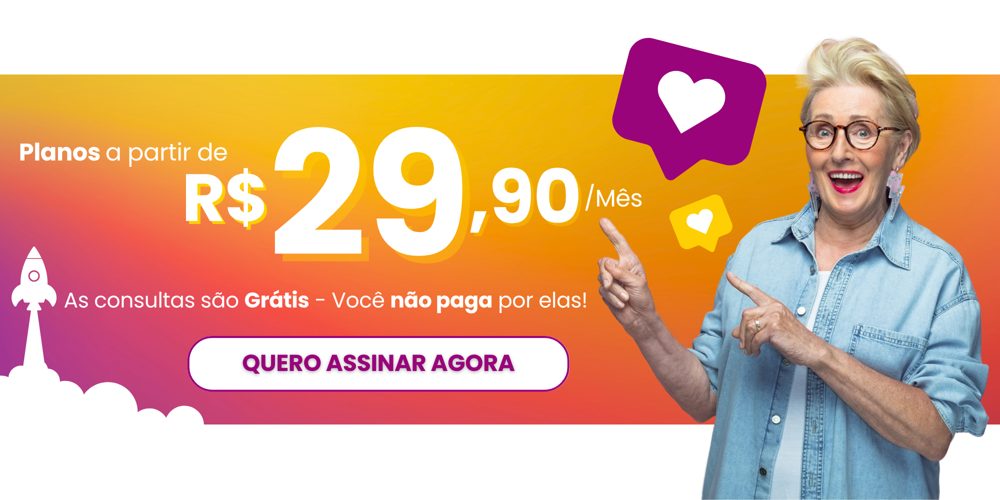
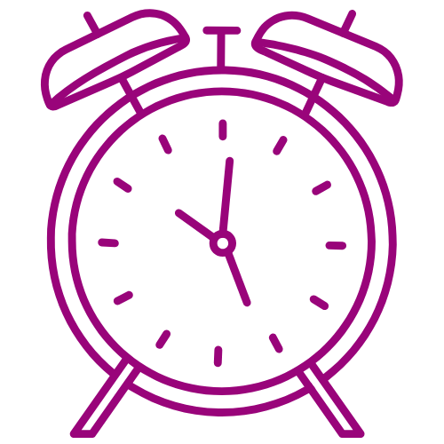
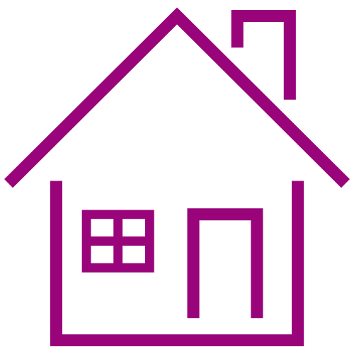
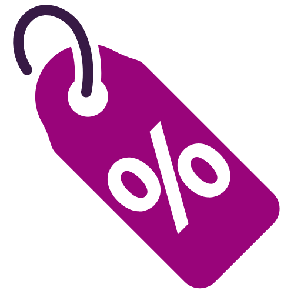
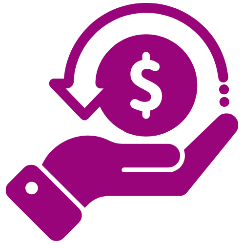
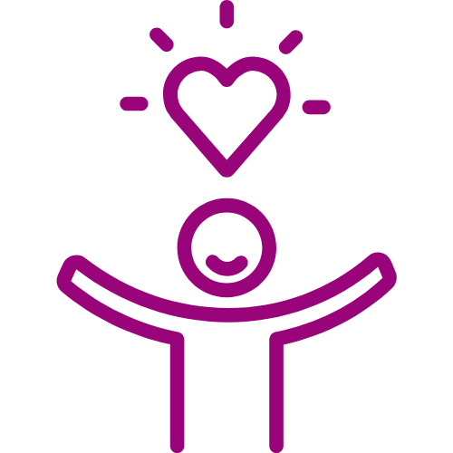
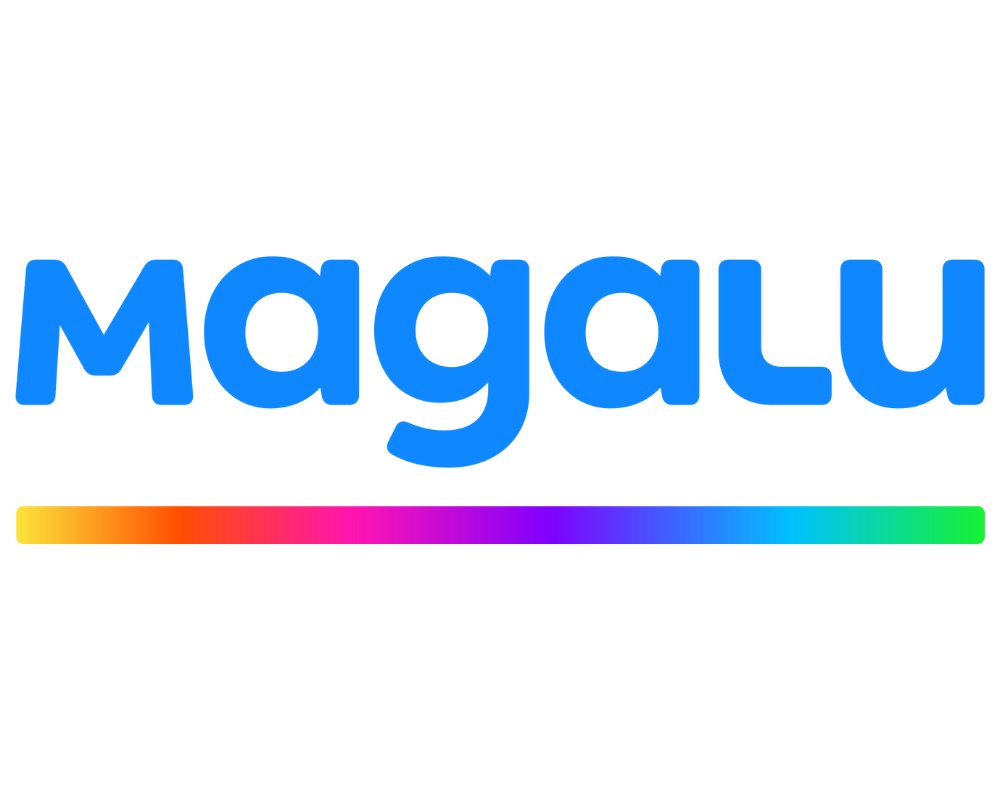
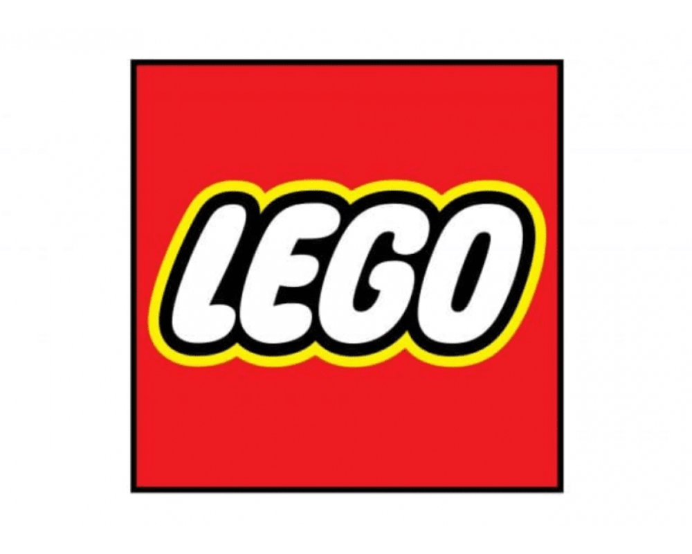
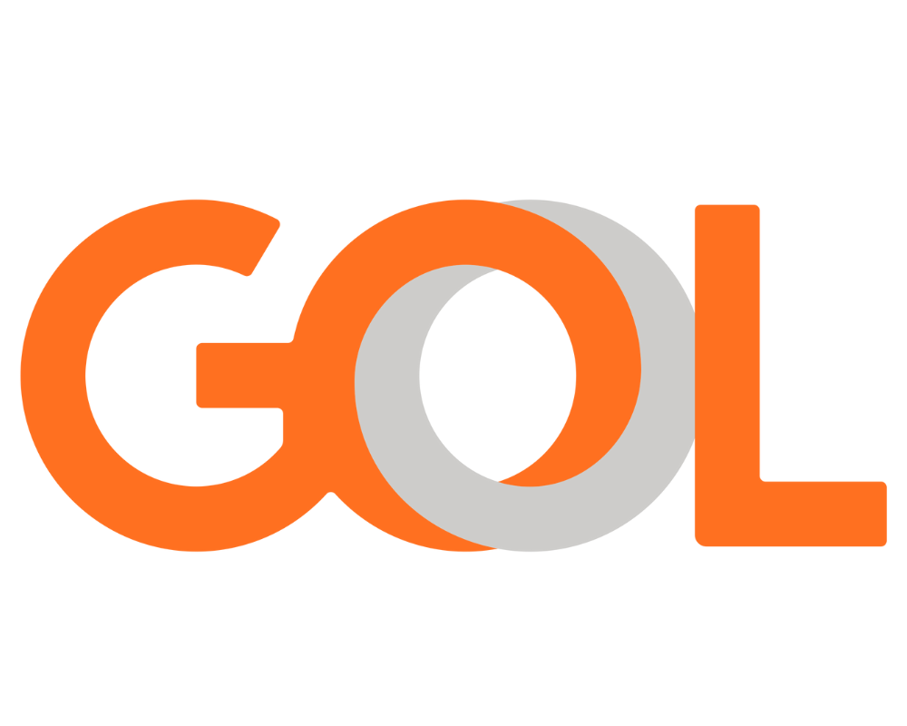
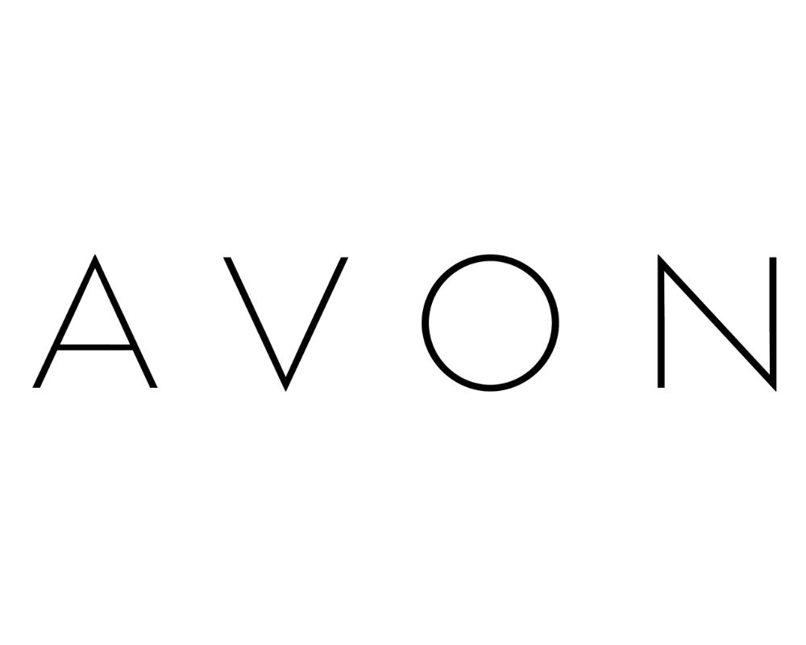

# Estrutura do Site Original (Clube Tindico)\n\n## 1. Menu Principal\n- **Início**: Aponta para `Index.aspx`
- **O Clube**: Aponta para `goTranslate("#containerEditavel-125411")`
- **Como Funciona**: Aponta para `goTranslate("#containerEditavel-124216")`
- **Telemedicina**: Aponta para `goTranslate("#containerEditavel-124217")`
- **Planos**: Aponta para `goTranslate("#containerEditavel-124219")`
- **Dúvidas**: Aponta para `goTranslate("#containerEditavel-125419")`
- **Início**: Aponta para `Index.aspx`
- **O Clube**: Aponta para `goTranslate("#containerEditavel-125411")`
- **Como Funciona**: Aponta para `goTranslate("#containerEditavel-124216")`
- **Telemedicina**: Aponta para `goTranslate("#containerEditavel-124217")`
- **Planos**: Aponta para `goTranslate("#containerEditavel-124219")`
- **Dúvidas**: Aponta para `goTranslate("#containerEditavel-125419")`
- **Botão Login (Minha Conta)**: Aponta para `https://cadastro.clubetindico.com.br/login`
\n---\n\n## 2. Conteúdo da Página\n\n  

Atendimento médico imediato, na palma da sua mão.

Planos de saúde acessíveis com telemedicina 24h, especialistas, psicólogos, nutricionistas e muito mais. Sem burocracia, sem carência, sem fila.

[Conheça nossos planos](https://cadastro.clubetindico.com.br)

CONSULTE AGORA COM OS MELHORES MÉDICOS DO PAÍS

A **maior plataforma** de telemedicina da **América Latina**, agora na palma da sua mão.

 \>

**O CLUBE**

Somos um clube de **assinatura de saúde** que conecta você a centenas de **médicos, psicólogos** e **nutricionistas** em todo o país, por meio da **telemedicina via videochamada.**

**O que os clientes falam sobre nós**

“Usei a telemedicina do Tindico no fim de semana, sem sair de casa e fui muito bem atendida. Recebi receita e orientação certinha. Super recomendo!”

**— Patrícia M., Governador Valadares – MG**

“Minha filha teve febre à noite e em poucos minutos conseguimos atendimento com o pediatra. Rápido, prático e sem estresse.”

**— Roberto A., Campinas – SP**

“Assinei o plano Family e toda minha família está usando. Já  
economizamos muito com consultas e exames. Vale cada centavo.”

**— Luciana F., Fortaleza – CE**

“O que mais gostei foi da facilidade. Fiz tudo pelo celular e em menos de  
10 minutos já estava falando com o médico.”

**— Carlos H., Vitória – ES**

“Passei por uma consulta com psicóloga pelo Tindico e foi incrível.  
Atendimento humanizado e acolhedor.”

**— Renata S., Rio de Janeiro – RJ**

“Antes gastava muito com médico particular. Agora pago um valor fixo e  
tenho acesso até a especialistas. Tindico é economia e cuidado de verdade.”

**— João V., Curitiba – PR**

“Usei a telemedicina do Tindico no fim de semana, sem sair de casa e fui muito bem atendida. Recebi receita e orientação certinha. Super recomendo!”

**— Patrícia M., Governador Valadares – MG**

“Minha filha teve febre à noite e em poucos minutos conseguimos atendimento com o pediatra. Rápido, prático e sem estresse.”

**— Roberto A., Campinas – SP**

“Assinei o plano Family e toda minha família está usando. Já  
economizamos muito com consultas e exames. Vale cada centavo.”

**— Luciana F., Fortaleza – CE**

“O que mais gostei foi da facilidade. Fiz tudo pelo celular e em menos de  
10 minutos já estava falando com o médico.”

**— Carlos H., Vitória – ES**

“Passei por uma consulta com psicóloga pelo Tindico e foi incrível.  
Atendimento humanizado e acolhedor.”

**— Renata S., Rio de Janeiro – RJ**

“Antes gastava muito com médico particular. Agora pago um valor fixo e  
tenho acesso até a especialistas. Tindico é economia e cuidado de verdade.”

**— João V., Curitiba – PR**

FAÇA UMA CONSULTA ONLINE VIA TELEMEDICINA

**E APROVEITE TODAS AS VANTAGENS**

**Consultas gratuitas:**

Atendimento médico sem custo adicional.

**Acesso rápido e prático:**

Conecte-se com médicos em minutos.

**Segurança e conforto:**

Atendimento seguro sem sair de casa.

**Cuidado preventivo:**

Acompanhamento médico contínuo.

**Descontos exclusivos:**

Economize nos maiores marketplaces e lojas locais.

**Cashback garantido:**

Receba parte do seu dinheiro de volta em compras.

[Conheça nossos planos](https://cadastro.clubetindico.com.br/assinar/trend-mensal)

COMO FUNCIONA

Siga 3 passos simples!

**1\. ESCOLHA SEU PLANO**

Compare os benefícios e selecione o **plano que melhor atende** às suas necessidades — individual, familiar ou uso pontual.

**2\. FAÇA SUA ASSINATURA**

Preencha um cadastro rápido, escolha a **forma de pagamento** e pronto. Use por 7 dias grátis.

**3\. USE QUANDO QUISER**

Acesse o app ou portal web, clique em **“Telemedicina”** e fale com um médico em minutos. Simples assim.

[Saiba mais](https://cadastro.clubetindico.com.br/assinar/trend-mensal)

Já baixou o app do **Tindico?** Saúde a um clique nas lojas **Google e Apple.**

**TELEMEDICINA**

**Pronto atendimento 24h,** psicologia, nutrição e diversas especialidades!

**Pronto atendimento**  
Atendimento humanizado, adulto e pediátrico, sem filas, disponível 24 horas por dia, 7 dias por semana

**Especialidades Médicas**  
+30 especialidades ao seu alcançe

**Nutricionista**  
A diferença entre dieta e equilíbrio está na orientação certa

**Psicólogos(as)**  
Atendimento psicológico online, com sigilo, acolhimento e praticidade.

**Resolutividade**

Cerca de 95% dos casos de saúde são resolvidos em teleconsultas.

**+7mil profissionais de saúde**

Atendimento humanizado e diagnósticos precisos em uma única plataforma

**\+ 20milhões de vidas elegíveis**

Infraestrutura tecnológica assegurando atendimento a milhões de pessoas.

**\+ 400mil consultas por mês**

Prevenção e tratamentos personalizados pra cada paciente.

[Experimente grátis por 7 dias](https://cadastro.clubetindico.com.br/assinar/trend-mensal)

**PLANOS**

**Escolha o plano que combina com o cuidado que você merece.**

**TREND**  
Individual

 Clínico geral 24h/7 - Ilimitado

 Pediatra 24h/7 - Ilimitado

 Acesso ao clube de vantagens

 Não paga pela consulta

 Sem fidelidade, sem carência

 Cancele quando quiser

 Teste grátis por 7 dias

de R$ 35,90

**R$ 29,90 /mês**

[**primeiro(s) 6 meses**](#)

[Assinar](https://cadastro.clubetindico.com.br/checkout/trend-mensal)

**PREMIUM**  
Individual

 Clínico geral 24h/7 - Ilimitado

Pediatra 24h/7 - Ilimitado

 + Especialistas (1 consulta/mês)

 + Nutricionista (1 consulta/mês)

 Acesso ao clube de vantagens

 Não paga pela consulta

 Sem fidelidade, sem carência

 Cancele quando quiser

 Teste grátis por 7 dias

de R$ 55,90

**R$ 45,90 /mês**

[**primeiro(s) 6 meses**](#)

[Assinar](https://cadastro.clubetindico.com.br/checkout/premium-mensal)

**MASTER**  
Individual

 Clínico geral 24h/7 - Ilimitado

 Pediatra 24h/7 - Ilimitado

 + Especialistas (1 consulta/mês)

 + Nutricionista (1 consulta/mês)

 + Psicólogo(a) (2 consulta/mês)

 Acesso ao clube de vantagens

 Não paga pela consulta

 Sem fidelidade, sem carência

 Cancele quando quiser

 Teste grátis por 7 dias

de R$ 75,90

**R$ 62,90 /mês**

[**primeiro(s) 6 meses**](#)

[Assinar](https://cadastro.clubetindico.com.br/checkout/master-mensal)

**FAMILY**  
1 titular + 4 dependentes

 Clínico geral 24h/7 - Ilimitado

 Pediatra 24h/7 - Ilimitado

 + Especialistas (3 consultas/mês)

 + Nutricionista (1 consulta/mês)

 + Psicólogo(a) (2 consulta/mês)

 Acesso ao clube de vantagens

 Não paga pela consulta

 Sem fidelidade, sem carência

 Cancele quando quiser

 Teste grátis por 7 dias

**R$ 189,90 /mês**

[Todos tem direito ao mesmo benefício!](#)

[Assinar](https://cadastro.clubetindico.com.br/checkout/familiar-mensal)

**FLEX**  
Sem mensalidades

 Clínico geral 24h/7 - R$ 65,00

 Pediatra 24h/7 - R$ 65,00

 Especialidade G1 - R$ 140,00

 Especialidade G2 - R$ 145,00

 Especialidade G3 - R$ 165,00

 Especialidade G4 - R$ 200,00

 Psicologia e Nutrição - R$ 75,00

 Paga somente a consulta

 Acesso ao clube de vantagens

 Teste grátis por 7 dias

**[Acesse e pague apenas a consulta!](#)**

[EM BREVE](#)

**PERGUNTAS FREQUENTES**

**Quer saber mais sobre o app ?**

-   ###  O que é o Tindico?
    
    Uma plataforma de teleconsulta que permite ao paciente fazer uma consulta a distância com um profissional de saúde via videochamada
    
-   ###  O Tindico atende em todo o Brasil?
    
    Sim! Como o atendimento é 100% online, você pode usar de qualquer lugar do mundo. Nossa plataforma é hoje uma das maiores da América Latina.
    
-   ###  Existe limite de consultas no Tindico?
    
    Depende do tipo de consulta e do plano escolhido, por exemplo:
    
    -   \- Pronto Atendimento (clínico geral e pediatra): são consultas ilimitadas, 24h por dia, todos os dias da semana.
    
    -   \- Especialidades (médicos especialistas, nutricionista, psicólogo): há um limite mensal, conforme o plano. Se precisar, é possível adquirir consultas extras
    
-   ###  Preciso marcar horário para usar o Tindico?
    
    Para o Pronto Atendimento, não precisa marcar horário – o acesso é imediato. Para especialistas, é necessário agendamento prévio dentro da própria plataforma.
    
-   ###  Quais são os métodos de pagamentos aceitos?
    
    Você pode escolher Pix, boleto bancário ou cartão de crédito.
    
-   ###  Posso cancelar quando quiser?
    
    Sim. A assinatura é flexível e pode ser cancelada a qualquer momento, sem nenhuma taxa.
    
-   ###  Recebo algum documento médico?
    
    Sim. Após a consulta, o(a) médico(a) pode emitir Receita Médica Digital válida em todo o território nacional, além de Pedidos de Exames e Atestados, quando necessário.
    
-   ###  Como funciona a receita digital?
    
    1.  1 - O médico emite a receita eletrônica virtual diretamente em nossa plataforma, através de assinatura digital.
    
    3.  2 - O paciente recebe um SMS com um link para a receita, que tem validade nacional. A receita também pode ser utilizada via QR Code ou baixada em PDF para apresentar na farmácia.
    
    5.  3 - Assim, é possível realizar a compra do remédio presencialmente ou a distância, oferecendo conforto e segurança ao paciente.
    
    **Obs.** Todas as prescrições possuem um código único identificador, em que constam os dados do médico e da receita. Portanto, para aqueles medicamentos de uso onde há retenção do receituário, o documento somente poderá ser utilizado uma única vez.
    
-   ###  Precisa de um e-mail para acessar a plataforma?
    
    Sim, é necessário ter uma conta de e-mail para criar seu usuário e realizar o login na plataforma. Caso não tenha um e-mail, crie uma conta neste link ([https://cadastro.clubetindico.com.br/assinar/trend-mensal](https://cadastro.clubetindico.com.br/assinar/trend-mensal)). Ainda, poderá usar por 7 dias grátis.
    
-   ###  Como sei que serei realmente atendido(a) por um(a) médico(a)?
    
    Nós somos extremamente criteriosos na escolha de nossos especialistas, por isso, fique tranquilo. Todos os nossos médicos possuem documentação validada pelo Conselho Regional de Medicina.
    
    O CRM de cada médico está disponível no perfil do médico, na própria plataforma. Para averiguar se o CRM confere com o médico selecionado, utilize o site do Conselho Federal de Medicina, através deste link: [https://portal.cfm.org.br/busca-medicos/](https://portal.cfm.org.br/busca-medicos/)
    
    Qualquer dúvida estamos à disposição através dos canais de atendimento.
    
-   ###  Os meus dados são mesmo sigilosos?
    
    Sim, nossa plataforma oferece um elevado padrão de segurança de dados. Todas as informações inseridas em nosso sistema são criptografadas. Tudo isso é realizado com base na lei geral de proteção de dados - LGPD (Lei nº 13.709, de 14/8/2018)
    

[Saiba mais](https://api.whatsapp.com/send/?phone=5527998159126&text&type=phone_number&app_absent=0)

Para se consultar via  
Telemedicina é simples!

Basta ter **acesso a internet**

Um aparelho **celular ou notebook** com câmera

Fazer login através do **app ou portal web**

**Descomplique o acesso à sua consulta médica com a teleconsulta**

Torne-se paciente do Tindico e conecte-se aos benefícios que essa relação oferece. Realize o cadastro e comece já a investir no seu maior bem: você!

[Consultar agora](https://cadastro.clubetindico.com.br/assinar/premium-mensal)

**ALGUNS DOS NOSSOS PARCEIROS**

 

 

 

 

 

 

Seja Parceiro Lojista do Tindico

**Quer promover o seu negócio, ofertando descontos e benefícios?**

Preencha os campos abaixo, que o nosso time comercial entrará em contato para dar sequência no cadastramento!

Seu Nome

Cargo\*

Nome da Empresa

Ramo de Atividade

Digite seu e-mail aqui

Seu telefone

Prove que você não é um robô (8 + 2)\*

 SEJA UM PARCEIRO

**Acompanhe a gente nas redes e fique por dentro!**

     

**Contato**

contato@clubetindico.com.br  
27 99815-9126

* * *

Somos um clube de saúde por assinatura com foco em telemedicina acessível e atendimento humanizado. Comercializamos planos mensais que oferecem consultas online com clínico geral e pediatra 24h, além de acesso a mais de 30 especialidades médicas, nutricionista e psicólogo, de acordo com o plano escolhido.

##### Sobre

Somos um clube de saúde por assinatura com foco em telemedicina acessível e atendimento humanizado. Comercializamos planos mensais que oferecem consultas online com clínico geral e pediatra 24h, além de acesso a mais de 30 especialidades médicas, nutricionista e psicólogo, de acordo com o plano escolhido.

##### Contato

[contato@clubetindico.com.br](mailto:contato@clubetindico.com.br)

(27) 99815-9126

© 2026 TINDICO BENEFICIOS E SERVICOS. Direitos reservados.  
[Denunciar conteúdo](#)

    

Texto original

Avalie a tradução

O feedback vai ser usado para ajudar a melhorar o Google Tradutor

Selecione o idiomaAbecásioAchinêsAcholiAfarAfricânerAimaráAlbanêsAlemãoAlurAmáricoAndebele (meridional)ÁrabeArmênioAssamêsAvarAwadhiAzerbaijanoBalinêsBalúchiBambaraBascoBashkirBatak karoBatak simalungunBatak tobaBaúleBembaBengaliBetawiBielorrussoBikolBoiapuriBósnioBretãoBúlgaroBuriataCanarêsCantonêsCatalãoCazaqueCebuanoChamorroChechenoChicheuaChinês (simplificado)Chinês (tradicional)ChonaChuquêsChuvacheCingalêsCómiConcaniCoreanoCorsoCrioulo das SeichellesCrioulo haitianoCrioulo mauricianoCroataCurdo (kurmanji)Curdo (sorâni)DariDinamarquêsDincaDiúlaDiveíDogriDombeDzongaEslovacoEslovenoEspanholEsperantoEstonianoFaroêsFijianoFilipinoFinlandêsFonFrancêsFrancês (Canadá)FrísioFriulanoFulaniGaaGaélico escocêsGalegoGalêsGeorgianoGregoGroenlandêsGuaraniGuzerateHakha ChinHauçáHavaianoHebraicoHiligaynonHindiHmongHolandêsHúngaroHunsrikIacutoIbanIgboIídicheIlocanoIndonésioInglêsInuíte (latino)InuktutIorubáIrlandêsIslandêsItalianoIucatequeJaponêsJavanêsJejeJingphoKanuriKhasiKhmerKitubaKokborokKrioLaosianoLatgálioLatimLetãoLígureLimburguêsLingalaLituanoLombardoLugandaLuoLuxemburguêsMacedônioMadurêsMaithiliMakassarêsMalaialaMalaioMalaio (jawi)MalgaxeMaltêsMamManxMaoriMarataMari das campinasMarshallêsMarwadiMeiteilon (manipuri)MinangMizoMongolMyanmar (Birmanês)Náuatle (huasteca oriental)NdauNepalbhasa (neuari)NepalêsNKoNorueguêsNuerOccitânicoOdia (Oriá)OromoOssetaPachtoPampangoPangasinêsPapiamentoPatoá jamaicanoPersaPolonêsPortuguês (Brasil)Português (Portugal)Punjabi (gurmukhi)Punjabi (shahmukhi)QueqchiQuíchuaQuicongoQuiniaruandaQuirguizRomaniRomenoRukigaRundiRussoSami (setentrional)SamoanoSangoSânscritoSantali (latino)Santali (ol chiki)SepediSérvioSessotoSicilianoSilesianoSindiSomaliSossoSuaíliSuáziSuecoSundanêsTadjiqueTailandêsTaitianoTamazigueTamazigue (tifinague)TâmilTártaroTártaro da Crimeia (cirílico)Tártaro da Crimeia (latino)TchecoTelugoTétumTibetanoTigríniaTivTok pisinTonganêsTshilubaTsongaTsuanaTuluTumbukaTurcoTurcomanoTuvanoTwiUcranianoUdmurteUigurUrduUzbequeVendaVênetoVietnamitaWarayWolofXãXhosaZapotecaZulu

Powered by [Tradutor](https://translate.google.com)